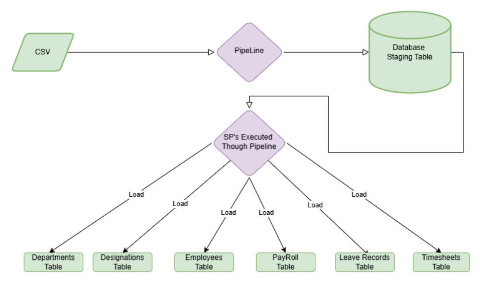

  # Payroll ETL Pipeline
  
  This project implements a robust ETL (Extract, Transform, Load) pipeline using Python, pandas, and SQL Server to automate payroll data processing. The pipeline efficiently extracts data from CSV files, transforms it using stored procedures, and loads it into multiple related tables within a SQL Server database.
  
  ## Table of Contents
  
  - [Project Goal](#project-goal)
  - [Technologies Used](#technologies-used)
  - [Data Flow](#data-flow)
  - [Setup](#setup)
  - [Usage](#usage)
  - [Data Transformation Details](#data-transformation-details)
  - [Testing](#testing)
  - [Future Enhancements](#future-enhancements)
  - [License](#license)
  
  ## Project Goal
  
  To automate and streamline the processing of payroll data, improving efficiency, accuracy, and reducing manual effort.
  
  ## Technologies Used
  
  *   Python 3.7+
  *   pandas
  *   SQLAlchemy
  *   pyodbc (or other suitable SQL Server driver)
  *   SQL Server
  
  ## Data Flow
  
  The data flows through the pipeline as follows:
  
  1.  **Extraction:** Payroll data is extracted from CSV files.
  2.  **Transformation:** The extracted data is then transformed using stored procedures within the SQL Server database. This includes data cleaning, calculations, and standardization.
  3.  **Loading:** Finally, the transformed data is loaded into multiple related tables within the SQL Server database, including:
      *   Departments Table
      *   Designations Table
      *   Employees Table
      *   Payroll Table
      *   Leave Records Table
      *   Timesheets Table
  
  
  
  ## Setup
  
  1.  **Clone the repository:**
      ```bash
      git clone [https://github.com/your user-name/payroll-etl.git](https://github.com/your user-name/payroll-etl.git)
      cd payroll-etl
      ```
  
  2.  **Create a virtual environment (recommended):**
      ```bash
      python3 -m venv venv
      source venv/bin/activate 
      ```
  
  3.  **Install dependencies:**
      ```bash
      pip install -r requirements.txt
      ```
  
  4.  **Set up the SQL Server database:**
      *   Create a database (e.g., `payroll_db`).
      *   Create the necessary tables with appropriate schemas (Departments, Designations, Employees, Payroll, Leave Records, Timesheets).  See the `database_schema.sql` file for an example schema.
  
  5.  **Configure the database connection:**
      *   Set environment variables for the database credentials (recommended):
          ```bash
          export DATABASE_URL="mssql+pyodbc://<user>:<password>@<host>/<database>?driver=ODBC+Driver+17+for+SQL+Server"
          ```
          (On Windows, use `set` instead of `export`.)
      *   Alternatively (less secure - do not commit credentials to version control): Edit the `config.py` file with your database connection details.
  
  ## Usage
  
  1.  **Prepare the input CSV files:** Place your payroll data CSV files in the `data` directory.
  
  2.  **Run the ETL pipeline:**
      ```bash
      python payroll_etl.py
      ```
  
  ## Data Transformation Details
  
  The stored procedures in SQL Server are responsible for the data transformation.  This includes:
  
  *   Data cleaning (handling missing values, removing duplicates).
  *   Calculations (calculating net pay, taxes, etc.).
  *   Data standardization (ensuring consistent date and currency formats).
  
  ## Testing
  
  check out the test_conection.py file.
  
  ## Future Enhancements
  
  *   Implement logging for better monitoring and debugging.
  *   Add data validation steps to ensure data quality.
  *   Explore scheduling options for automated runs.
  *   Consider adding support for other data sources.
  
  ## License
  
  MIT License 
